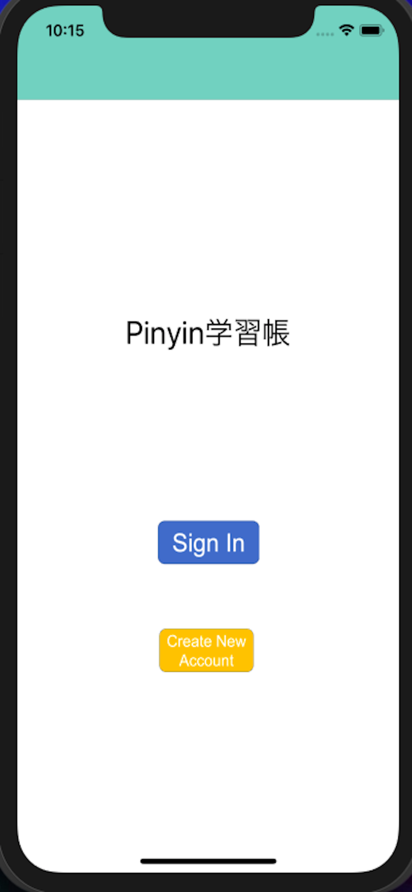
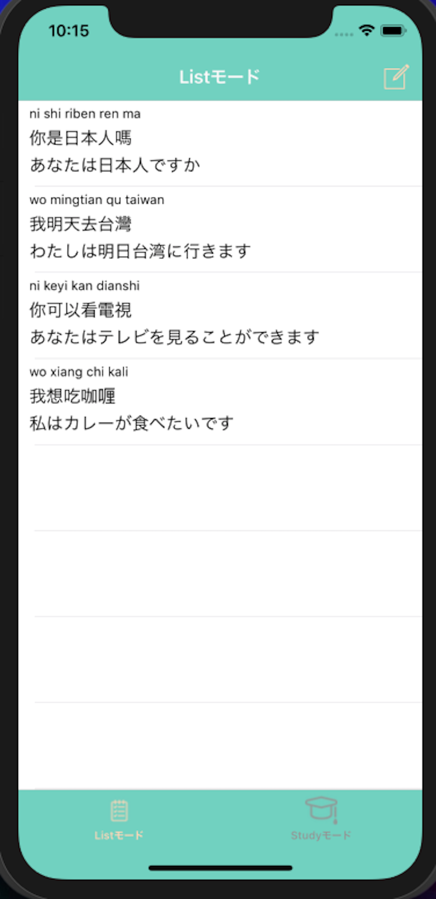
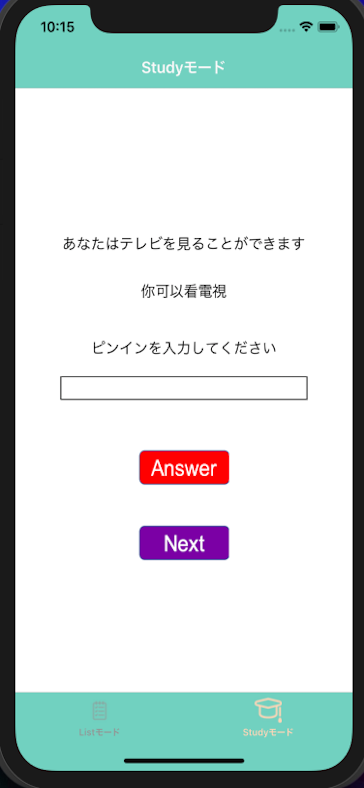

# StudyChinesePinyin

## About
This App is able to stock the Chinese sentences you want to remember. 
Make own vocabulary list by yourself. 
Help to study Chinese pinyin by making random question from the vocabulary list. 

|Login|List|Register|Study|
|:--:|:--:|:--:|:--:|
|||||

## Requirement
Firebase Cloud Firestore 
Firebase Authentication 

## Author
iOS Developer in Tokyo 
Kazuma Noha
